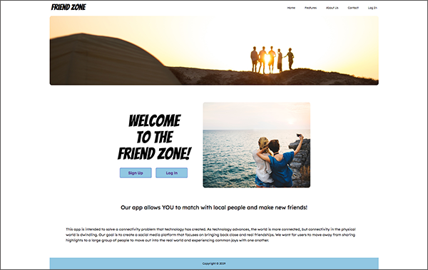
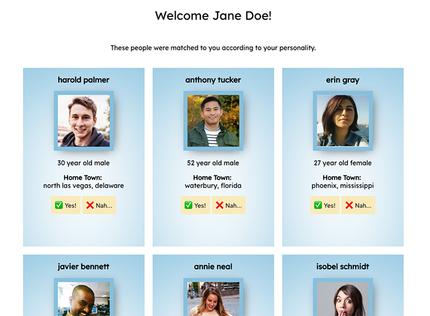
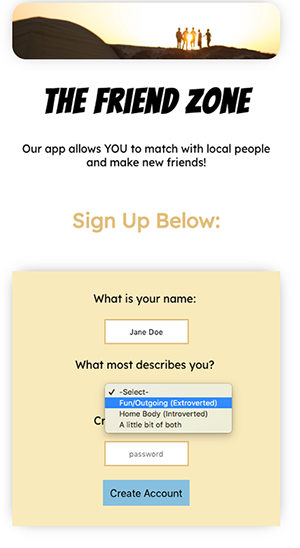

# The Friend Zone

Our app allows YOU to match with local people and make new friends!   

 

 

  

# About

This app is intended to solve a connectivity problem that technology has created. As technology advances, the world is more connected, but connectivity in the physical world is dwindling. Our goal is to create a social media platform that focuses on bringing back close and real friendships. We want for users to move away from sharing highlights to a large group of people to move out into the real world and experiencing common joys with one another.

  

# The Team

**Team Lead:**  
James Starks
  

**Front End Developers:** 
Sable Childs 
Jashele Tillman
  

**User Interface:** 
Cody Hayes 
Jeffrey Orndorff

  

# Links

<a href="https://friendfinderui.netlify.com/" target=_blank>The Friend Zone - Official Website</a>

<a href="https://docs.google.com/document/d/1eR53ciaygYFUZZZyFScopzOW49PDsB_IisJ1y1wTNVg/edit?usp=sharing" target=_blank>Case Study</a>

<a href="https://github.com/friends-finder" target=_blank>GitHub Organization</a>

<a href="https://trello.com/b/sTShoQIY/friend-finder" target=_blank>Trello Board</a>

