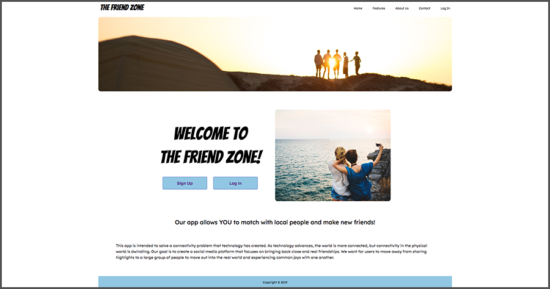
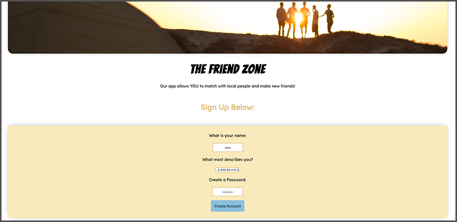
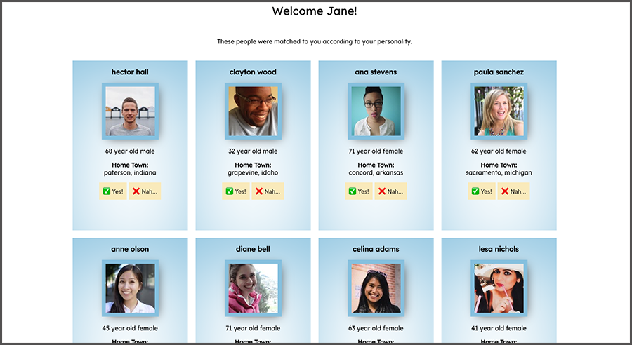

# The Friend Zone

The Friend Zone is an app idea designed to allow people to find strictly platonic friendships in their local area based on their personality. This social media platform focuses on bringing back real & close friendships. 

 
 

## Web UI 
By: <a href="" target="_blank">Cody Hayes</a> & <a href="" target="_blank">Jeffrey Orndorff</a>

 
 

## Front End
By: <a href="" target="_blank">Sable Childs</a> & <a href="" target="_blank">Jashele Tillman</a>

 
 

# About

This app is intended to solve a connectivity problem that technology has created. As technology advances, the world is more connected, but connectivity in the physical world is dwindling. Our goal is to create a social media platform that focuses on bringing back close and real friendships. We want for users to move away from sharing highlights to a large group of people to move out into the real world and experiencing common joys with one another.

  

# The Team

**Team Lead:**  
James Starks - <a href="https://github.com/Shadowborn" target=_blank>GitHub</a>
  

**Front End Developers:** 
Sable Childs - <a href="https://github.com/sablemadison" target=_blank>GitHub</a> 
Jashele Tillman - <a href="https://github.com/jasheloper" target=_blank>GitHub</a>
  

**User Interface:** 
Cody Hayes - <a href="https://github.com/Cody-Hayes97" target=_blank>GitHub</a> 
Jeffrey Orndorff - <a href="https://github.com/Jeffreyo3" target=_blank>GitHub</a>

  

# Links

- <a href="https://friendfinderui.netlify.com/" target=_blank>The Friend Zone - Official Website</a>

- <a href="https://docs.google.com/document/d/1eR53ciaygYFUZZZyFScopzOW49PDsB_IisJ1y1wTNVg/edit?usp=sharing" target=_blank>Case Study</a>

- <a href="https://github.com/friends-finder" target=_blank>GitHub Organization</a>

- <a href="https://trello.com/b/sTShoQIY/friend-finder" target=_blank>Trello Board</a>

